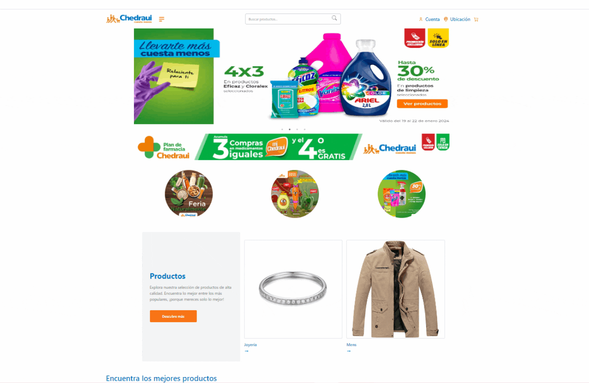

# Proyecto de eCommerce React

## Landing Page (LP)

Maquetación del header y body de la Landing Page. Selecciona una de las siguientes landings como referencia:

- [MartesMiércoles](https://www.chedraui.com.mx/martimiercoles)
- [Selecto](https://www.chedraui.com.mx/selecto)
- [Chedrauilandia](https://www.chedraui.com.mx/chedrauilandia)
- [Farmacia Chedraui](https://www.chedraui.com.mx/farmacia-chedraui)
- [Ofertas](https://www.chedraui.com.mx/ofertas)
- [Limpieza y Organización](https://www.chedraui.com.mx/limpieza-y-organizacion)

### Requerimientos:

- Funcionamiento de la LP sin links rotos.
- Contador interactivo.
- Imágenes como links a productos.
- Muestra de 2 categorías.
- Vitrina de productos de 2 categorías.

## 2. Página de Detalles del Producto (PDP)

Diseño abierto. Consumir el API de productos de Fakestore (https://fakestoreapi.com/).

### Requerimientos:

- Página de producto sencilla que debe contener: "id", "title", "price", "description", "category", "image", "rating", "rate", "count".

## Criterios de Aceptación

- Maquetación de la Home.
- Maquetación del PDP.
- Comentar las funciones utilizadas para el consumo de la API.

## **Desarrollo del PDP**

Este proyecto fue desarrollado utilizando las siguientes tecnologías y herramientas:

- **React**: El framework de JavaScript que facilita la creación de interfaces de usuario interactivas.

- **Axios**: Una biblioteca para hacer peticiones HTTP en el navegador y Node.js. En este proyecto, se utilizó para consumir la API de productos de Fakestore.

- **Tailwind CSS**: Un framework de utilidad de CSS que facilita la creación de interfaces modernas y con un diseño consistente.

Además de estas tecnologías, se siguieron buenas prácticas de maquetación y diseño para lograr una experiencia de usuario agradable y fácil de entender.

## Inspiración y Uso de la API

Me inspiré en el diseño de la landing page de ofertas de [Chedraui](https://www.chedraui.com.mx/ofertas) para crear una interfaz atractiva y funcional. Me propuse capturar la esencia y la disposición de elementos que hacen que la página sea visualmente agradable y fácil de navegar.

Para la obtención de datos de productos, utilicé la API de Fakestore, específicamente [Fakestore API](https://fakestoreapi.com/docs). Esta API proporciona datos simulados de productos, lo que me permitió mostrar información detallada de productos, como nombre, precio, descripción y categoría.

En el desarrollo de la funcionalidad de carrito de compras, implementé un sistema que permite agregar y eliminar productos, así como calcular dinámicamente el total de la compra. La integración con la API me permitió simular el proceso de compra y mejorar la experiencia del usuario.

Esta combinación de inspiración en el diseño de la landing page de ofertas de Chedraui y la utilización de datos de productos de la API de Fakestore resultó en una aplicación web atractiva y totalmente funcional.

## Prpuesta de diseño 

La propuesta de diseño, respaldada por capturas de pantalla y una animación, ofrece una vista previa visual de la experiencia de usuario que se ha creado.

En resumen, esta página de eCommerce React ofrece una experiencia completa: desde la exploración del catálogo hasta la descripción detallada de productos y la gestión eficiente del carrito de compras.

### Navegación Intuitiva

La página de inicio se diseñó con una navegación intuitiva, inspirada en la disposición visualmente agradable de la landing page de ofertas de Chedraui. Desde aquí, puedes explorar dos categorías distintas, cada una enlazada a su respectiva vitrina de productos.

### Detalles del Producto

Al hacer clic en un producto, serás redirigido a una página de detalles del producto (PDP). Aquí, encontrarás información esencial, como el título, precio, descripción, categoría, imagen y la calificación del producto. Esta sección proporciona una visión detallada para ayudarte a tomar decisiones informadas de compra.

### Carrito de Compras

La funcionalidad del carrito de compras permite agregar productos con un simple clic. Puedes aumentar o disminuir la cantidad de cada producto directamente desde el carrito. Además, el carrito ofrece la opción de eliminar productos, brindándote total control sobre tus selecciones.

### Exploración del Catálogo

La página también te invita a explorar el catálogo completo, donde puedes navegar entre diferentes categorías y descubrir una amplia variedad de productos. Imágenes atractivas enlazan directamente a los productos, facilitando la experiencia de compra.

### Práctico Contador Interactivo

Un contador interactivo agrega un toque dinámico a la página, proporcionando una experiencia de usuario envolvente y amigable.

### Desarrollo Tecnológico

El desarrollo se llevó a cabo utilizando React para la construcción de la interfaz, Axios para consumir la API de Fakestore y Tailwind CSS para un diseño moderno y responsivo.

